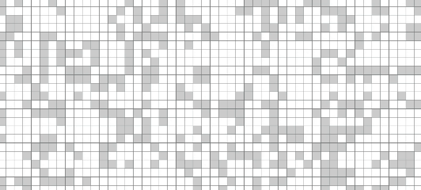

    cellular automation "game of life" by john h. conway

    rules: 
    1. live cell with fewer than 2 live neighbors -> dies. (underpopulation)
    2. live cell with 2 or 3 live neighbors -> lives on to the next generation. (perfect)
    3. live cell with more than 3 live neighbors -> dies. (overpopulation)
    4. "dead" / unpopulated cell with exactly 3 live neighbors -> becomes a live cell. (reproduction)

    live cells interact with it's 8 neighbors. 
    neighbors cells are the 8 cells adjacent to the live cell.

    [a] [b] [c]
    [d] [_] [e]
    [f] [g] [h]

